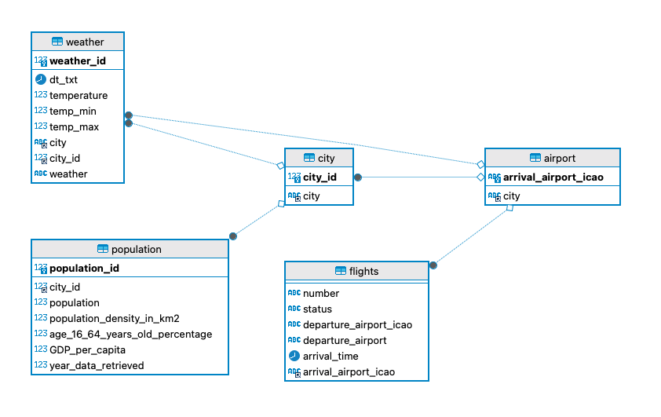

# Efficient In-House Data Pipelines for e-scooter startup.

Gans is a startup developing an e-scooter-sharing system. It aspires to operate in the most populated cities all around the world. 

Additionally, the company plans to deploy hundreds of e-scooters on various streets across each city, offering users the option to rent them per minute.

Ideally, scooters should naturally redistribute themselves equally through users traveling from point A to point B and vice versa. However, various factors lead to imbalances:

* In cities with hills, users ride scooters uphill and prefer walking downhill.
* Mornings typically see scooters moving from residential areas to city centers.
* E-scooter usage significantly drops when it begins to rain.
* Young tourists, especially those on budget flights, are a vital user demographic; however, they need scooters in downtown areas or near tourist attractions.

Regardless, the company aims to predict scooter movements proactively. While predictive modeling is a future goal, the initial focus is gathering, processing, and storing more data properly. The task of this project is to create external data that could assist in forecasting e-scooter trends for Gans. 

Given the need for daily, real-time data accessible to all company members, the main challenge lies in constructing and automating a cloud-based data pipeline.


## Objective


The main objective of this project is to create an automatic data pipeline that will help the company make better investment decisions. 

## Project's Folder Structure

This project is organized into several directories, each serving a specific purpose. Below is the structure and description of these directories:

- `/images`: This directory contains different screenshots from the project.

- `/src`: Inside this folder, you will find the  Jupiter Notebook code and SQL scripts.

- `/plots`: This directory houses all the plots generated as part of this project. 


## Step by step process: Local Data Pipeline

During the initial stage of our project, our primary goal is to set up a reliable data pipeline at the local level. This includes concentrating on two main methods of data acquisition: extracting data from websites and using Application Programming Interfaces (APIs). We'll then store this data in a Structured Query Language (SQL) database.


The initial action we'll take is to develop a relational SQL schema to accommodate various kinds of data. Three of our tables will contain static data within this schema, while the remaining two will be designed for dynamic updates. 

Below is the final project's schema:





## Google Cloud Automation


The subsequent phase includes moving this system to a cloud-based setting.

We have selected Google Cloud as our preferred platform for this endeavor, largely because it provides a free trial period, which makes it an attractive option for our first venture into the cloud.

Next, our task is to establish Google Cloud Functions, which will act as a bridge linking your local systems with cloud implementations. These functions are designed to be reactive and triggered by various events. In the context of our project, these Google Cloud Functions will be set up to handle HTTP requests from a web application and make necessary alterations to the data.

 All Python functions should have a specific format you should stick to:


```python
import functions_framework
# Register an HTTP function with the Functions Framework
@functions_framework.http
def my_http_function(request):
    # Your code here

    # Return an HTTP response
    return 'OK'
```

## Findings 

* This relational design efficiently supports queries across various aspects of city life and services, from analyzing the impact of weather or flight schedules that will help us understand a possible correlation between a city’s economic status, flight activity and scooter sharing.
* The airport table is associated with the city table via the city ID, allowing the database to map each airport to its respective city.
* The flights table includes details about flight numbers, statuses, departure, and arrival times, and is linked to airports, thus enabling tracking of flights to and from the cities.